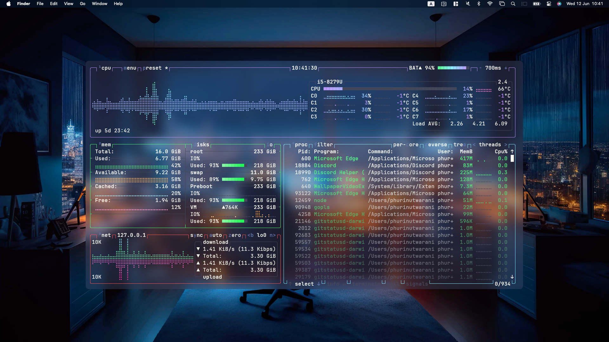

## :zap: phurinutwara's dotfiles

:rainbow: **Showcases**



---

:sparkles: **Features**

| Tool    | Ready ?            |
| ------- | ------------------ |
| Neovim  | :white_check_mark: |
| TMUX    | :white_check_mark: |
| Wezterm | :white_check_mark: |

---

:pushpin: **How to use**

1. Clone this repo to your machine

```bash
$ git clone --recursive git@github.com:itsphurin/dotfiles.git ~/dotfiles
```

2. Go to dotfiles directory and execute the installer

```bash
$ cd ~/dotfiles && ./install
```

---

<details>
        <summary>
                📚 <b>TODOs</b>
        </summary>

- [x] Terminal Preferences (via dotfile installation)
- [x] Changed Shell to ZSH (via dotfile installation)
- [x] Maximize key repeat period (configured for arch)
- [x] Git (config and SSH)
- [x] use arch on mac (See more: https://github.com/kyoz/mac-arch
                                 https://t2linux.org
                                 https://wiki.archlinux.org/title/Mac
                                 https://bbs.archlinux.org/viewtopic.php?id=122700)
</details>
