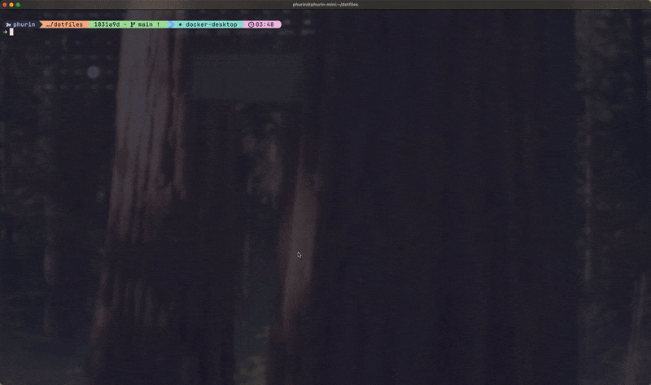

# dotfiles


Personal development environment managed with [Dotbot](https://github.com/anishathalye/dotbot).

## Preview



## Stack

| Category | Tool |
|----------|------|
| Shell | zsh + oh-my-zsh |
| Prompt | starship |
| Editor | neovim (Lua config) |
| Terminal | kitty |
| Multiplexer | tmux + tmux-resurrect |

## Install

```bash
git clone --recursive git@github.com:itsphurin/dotfiles.git ~/dotfiles
cd ~/dotfiles && ./install
```

## Structure

```
zsh/           # Shell config and scripts
  scripts/     # Sourced utilities (git, k8s, brew helpers)
  scripts/custom/  # Your custom scripts (auto-loaded)
config/        # XDG configs (nvim, kitty, hypr, etc.)
macos/         # Brewfile and macOS defaults
arch/          # Arch Linux setup and package lists
tmux/          # Tmux configuration
```

## Customization

Add personal shell functions to `zsh/scripts/custom/*.sh` — they load automatically.

## License

[MIT](LICENSE)
