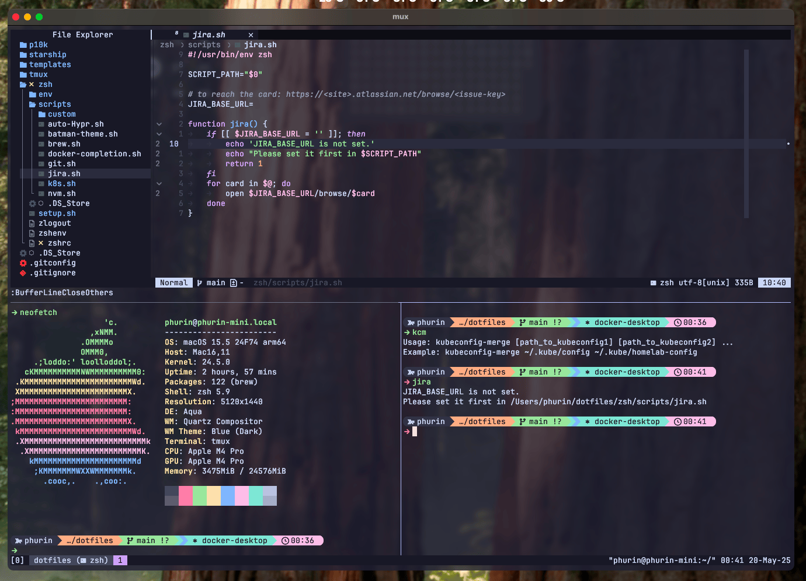

# :zap: Phurinut's dotfiles

Welcome to my personal dotfiles! This repository is the heart of my daily development workflow, optimized for speed, minimal context switching, and deep CLI productivity.

## 📸 Example Workflow

Here's a glimpse of my daily development workflow using Kitty, Tmux, and Neovim seamlessly integrated.



## :sparkles: **Key Features**

- 🖥️ **Terminal & Prompt**

  - `starship` for blazing-fast and beautiful command prompt.
  - Custom Powerline-style tmux status bar.
  - `kitty` installer for use seamlessly across multiple OS.

- 📚 **Editor**

  - Fully customized `Neovim` with Lua config.
  - Plugins for LSP, Treesitter, Telescope, and smooth scrolling.
  - Intuitive key mappings for faster navigation and coding.

- 📂 **Multiplexer**

  - `tmux` + `tmux-resurrect` for session persistence and `tmuxinator` for sessioning across project folder.
  - Custom `tmux` plugins for pane management and productivity.

- ⚙️ **ZSH Enhancements**

  - Oh-My-Zsh + Custom Plugins.
  - Useful shell functions stored under `zsh/scripts` to automate daily repetitive tasks.
  - Kubernetes KUBECONFIG switcher and Git workflow shortcuts.

- 🐳 **Developer Utilities**
  - Docker & Kubernetes helper scripts.
  - Git alias shortcuts for safe and fast commits, logs, and rebase workflows.

## 🚀 Philosophy

> _“I believe that small optimizations in daily developer workflows compound into significant long-term productivity gains.”_

## :pushpin: **How to use**

1. Clone this repo to your machine

```bash
$ git clone --recursive git@github.com:itsphurin/dotfiles.git ~/dotfiles
```

2. Go to dotfiles directory and execute the installer

```bash
$ cd ~/dotfiles && ./install
```

---

📌 **Try it out or explore the scripts under `zsh/scripts` to find some hidden gems!**
